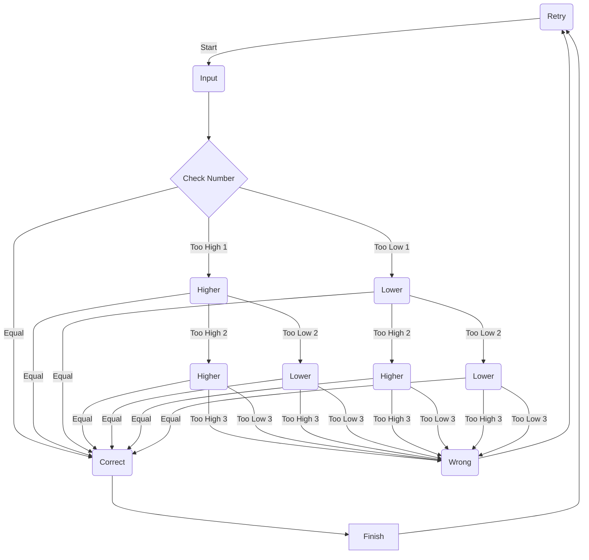

```mermaid
flowchart TD
  A[Play] --> |Start| B(Input)
  B ---> C{Check Number}
  C ---> |Too High 1| D(Higher)
  C ---> |Too Low 1| E(Lower)
  C ---> |Equal| F(Correct)
  D ---> |Too High 2| G(Higher)
  D ---> |Too Low 2| H(Lower)
  D ---> |Equal| F(Correct)
  E ---> |Too High 2| J(Higher)
  E ---> |Too Low 2| K(Lower)
  E ---> |Equal| F(Correct)
  G ---> |Too High 3| M(Wrong)
  G ---> |Too Low 3| M(Wrong)
  G ---> |Equal| F(Correct)
  H ---> |Too High 3| M(Wrong)
  H ---> |Too Low 3| M(Wrong)
  H ---> |Equal| F(Correct)
  J ---> |Too High 3| M(Wrong)
  J ---> |Too Low 3| M(Wrong)
  J ---> |Equal| F(Correct)
  K ---> |Too High 3| M(Wrong)
  K---> |Too Low 3| M(Wrong)
  K ---> |Equal| F(Correct) 
  
  F ---> Finish ---> A[Play Again]
  M ---> A(Retry)
  
  
```
